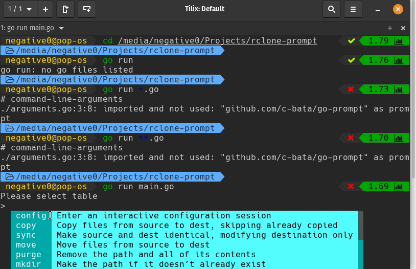

## Rclone Prompt 

An interactive command line application to run and manage rclone [rclone](https://github.com/rclone/rclone)



### Commands supported:

All the commands mentioned on the [rclone website](https://rclone.org/commands/) are supported.

### Run 

#### Clone:

```git clone https://github.com/negative0/rclone-prompt```

#### Compile:

```go build```

#### Run:

```./rclone-prompt```

### Exit 

use the keyword "exit" to exit the prompt
